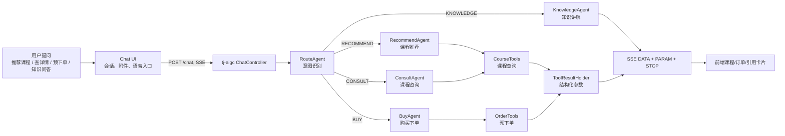
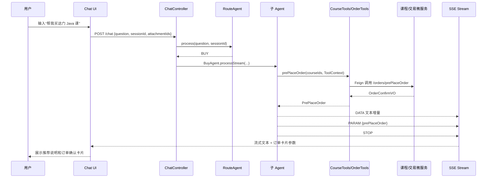
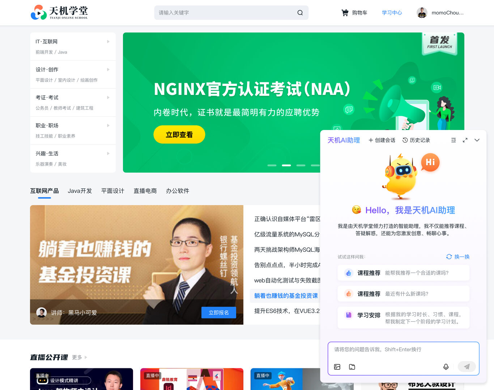
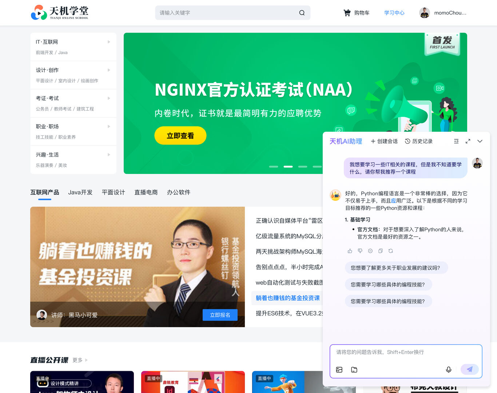

# tianji-ai-agent

课程业务 Agent 工程案例：用户提问 -> RouteAgent 意图识别 -> Recommend/Buy/Consult/Knowledge 子 Agent -> Tool Calling -> SSE 流式返回 -> 前端卡片展示。

[](https://github.com/however-yir/tianji-ai-agent/actions/workflows/ci.yml)
[](https://openjdk.org/)
[](https://spring.io/projects/spring-boot)
[](https://spring.io/projects/spring-ai)
[](https://maven.apache.org/)
[](.github/workflows/ci.yml)
[](#)

## 业务闭环

`tianji-ai-agent` 不再定位为“学习型 AI 工程合集”，而是一个围绕在线课程业务搭建的智能体样板项目。它要讲清楚一件事：当用户说“我想学 Java，帮我推荐并下单”时，系统如何完成意图识别、课程查询、订单预确认、结构化卡片回传和流式交互。

核心链路：

1. 用户在聊天前端输入课程咨询、推荐或购买问题。
2. `tj-aigc` 接收 `/chat` 请求，建立会话上下文和附件上下文。
3. `RouteAgent` 判断意图，路由到 `RecommendAgent`、`BuyAgent`、`ConsultAgent` 或 `KnowledgeAgent`。
4. 子 Agent 通过 `CourseTools`、`OrderTools` 调用课程和交易微服务。
5. `ToolResultHolder` 把工具结果转成 `PARAM` 事件，和模型文本一起通过 SSE 返回。
6. 前端消费 `DATA / PARAM / STOP` 事件，渲染课程卡片、订单卡片、引用来源和停止生成状态。

## 一眼看懂





## 聊天界面截图

| 默认对话 | 课程卡片 |
|---|---|
|  |  |

| 购买课程 | 语音入口 |
|---|---|
|  |  |

## 项目结构

```text
.
├── README.md
├── docs
│   ├── agent-design.md
│   ├── demo-script.md
│   ├── mcp-extension-guide.md
│   ├── assets/screenshots
│   └── evaluation
├── web/chat-ui
│   └── 课程业务 Agent 前端原型
└── 代码
    ├── openai-java-demo
    ├── my-spring-ai
    ├── my-spring-ai-mcp
    └── tjxt
        └── tj-aigc
```

| 模块 | 角色 | 展示价值 |
|---|---|---|
| `web/chat-ui` | React 聊天前端 | 会话、SSE、停止生成、附件、语音入口、课程/订单卡片 |
| `代码/tjxt/tj-aigc` | 业务 Agent 核心 | RouteAgent、子 Agent、Tool Calling、Redis 记忆、附件服务 |
| `代码/tjxt/tj-api` | 业务微服务契约 | CourseClient、TradeClient 等 Feign 接口 |
| `代码/openai-java-demo` | SDK 入门样例 | 保留教学路径，用课程推荐助手解释基础调用 |
| `代码/my-spring-ai` | Spring AI 能力样例 | ChatClient、Advisor、Tool、RAG、多模态基础能力 |
| `代码/my-spring-ai-mcp` | MCP 扩展示例 | 把工具封装为可复用 MCP Server/Client |

## Demo 闭环

演示脚本见 [docs/demo-script.md](docs/demo-script.md)。固定准备 5 个问题：

| 场景 | 演示问题 | 命中的后端链路 | 前端展示 |
|---|---|---|---|
| 课程推荐 | `我零基础，想 3 个月入门 Java 后端，帮我推荐课程` | `RouteAgent -> RecommendAgent -> CourseTools` | 推荐说明、课程卡片 |
| 课程详情 | `介绍一下 1589905661084430337 这门课适合谁，价格多少` | `RouteAgent -> ConsultAgent -> CourseTools` | 课程详情卡片 |
| 预下单 | `我要购买课程 1589905661084430337，帮我生成确认订单` | `RouteAgent -> BuyAgent -> OrderTools` | 订单确认卡片 |
| 知识问答 | `Java 中 Redis 缓存穿透是什么，怎么处理` | `RouteAgent -> KnowledgeAgent` | 流式知识回答 |
| 语音/多模态入口 | `上传一张课程截图，或用语音问“这门课适合我吗”` | `/attachment/upload`、`/audio/stt`、`/audio/tts-stream`、`/chat` | 附件引用、语音输入、流式回复 |

## 后端核心

`tj-aigc` 的接口以业务闭环为中心，而不是为了罗列框架能力：

| 接口 | 作用 | 前端对应 |
|---|---|---|
| `POST /session?n=4` | 新建会话并返回推荐问题 | 新会话按钮、示例问题 |
| `GET /session/history` | 查询历史会话分组 | 左侧会话列表 |
| `GET /session/{sessionId}` | 查询单会话消息 | 切换历史会话 |
| `POST /chat` | SSE 流式 Agent 对话 | 主输入框发送 |
| `POST /chat/stop` | 停止当前生成 | 停止按钮 |
| `POST /attachment/upload` | 上传文档/图片并返回附件 ID | 附件按钮 |
| `POST /audio/stt` | 语音转文本 | 语音输入入口 |
| `POST /audio/tts-stream` | 文本转语音 | 语音播放入口 |

关键类：

| 类 | 说明 |
|---|---|
| `ChatController` | 统一接入聊天、停止生成和模板接口 |
| `AgentServiceImpl` | 调用 `RouteAgent` 并分发到子 Agent |
| `RouteAgent` | 意图识别，只做路由，不使用附件上下文 |
| `RecommendAgent` | 课程推荐，绑定 `CourseTools` 与 RAG Advisor |
| `ConsultAgent` | 课程咨询，查询课程详情和补充解释 |
| `BuyAgent` | 购买链路，绑定 `OrderTools` 做预下单 |
| `KnowledgeAgent` | 通用知识讲解，不强依赖业务工具 |
| `CourseTools` | 调课程微服务，返回 `CourseInfo` |
| `OrderTools` | 调交易微服务，返回 `PrePlaceOrder` |
| `RedisChatMemory` | 会话记忆读写，支撑历史上下文 |
| `InMemoryAttachmentService` | dev/demo 可用的附件解析、切片、引用来源服务 |

更多设计说明见 [docs/agent-design.md](docs/agent-design.md)。

## 快速开始

推荐先跑 `dev-demo`，不用真实模型 Key，也不用登录。

```bash
bash scripts/quick-start-mac.sh
```

Windows:

```powershell
powershell -ExecutionPolicy Bypass -File .\scripts\quick-start-win.ps1
```

手动启动：

```bash
cp .env.example .env
docker compose -f docker-compose.dev.yml up --build
```

默认访问：

| 服务 | 地址 |
|---|---|
| Chat UI | `http://127.0.0.1:5173` |
| AIGC 后端 | `http://127.0.0.1:8094` |
| 热门问题接口 | `http://127.0.0.1:8094/session/hot` |

`dev-demo` 说明：

- 后端 profile：`dev-demo`
- 演示用户 ID：`10001`
- 演示 Token：`dev-demo-token`
- 本地演示默认关闭登录拦截
- 前端默认进入 demo 模式，也可以切到真实 API 模式联调

## 本地验证

前端：

```bash
cd web/chat-ui
npm ci
npm run lint
npm run test:run
npm run build
```

后端核心链路：

```bash
mvn -B -ntp -f 代码/tjxt/pom.xml -pl tj-aigc -am -DskipTests package
mvn -B -ntp -f 代码/tjxt/tj-aigc/pom.xml test
```

手工集成测试依赖真实模型、Nacos、业务中间件和密钥，默认通过 JUnit Tag 排除：

```bash
mvn -B -ntp -f 代码/tjxt/tj-aigc/pom.xml -Pmanual-integration-tests test
```

## CI 与质量门槛

仓库把“展示项目必须稳定”的链路设为阻断：

- `web/chat-ui`：lint、unit test、build
- `tj-aigc`：依赖链安装、单元测试
- `my-spring-ai`：编译打包
- Python smoke tests：仓库文档和脚本基础检查

非关键扫描保留为 advisory job，例如 Ruff 建议、通用 compileall、Gitleaks 扫描，避免因为可选工具噪声挡住核心业务链路。

## MCP 扩展

MCP 不是本项目的主叙事，但保留为“后续把课程、交易、搜索、浏览器自动化等工具标准化”的扩展位。

扩展指南见 [docs/mcp-extension-guide.md](docs/mcp-extension-guide.md)。

## 展示路线

适合面试、简历和 GitHub 项目页的讲法：

1. 先讲业务问题：课程咨询转化链路需要智能体理解意图并调用业务工具。
2. 再讲架构：RouteAgent 做分发，子 Agent 负责推荐、购买、咨询、知识问答。
3. 再讲工程细节：SSE 流式事件、ToolResultHolder 参数回传、RedisChatMemory、停止生成、附件引用。
4. 最后现场演示：输入购课问题，观察工具调用参数回传，前端展示课程/订单卡片。

录屏建议：

```text
用户输入购课问题 -> 后端 RouteAgent 命中 BuyAgent -> OrderTools 预下单 -> SSE 返回 DATA/PARAM/STOP -> 前端渲染订单卡片
```

## 资源说明

原始大体积设计稿和原型包默认不纳入主仓库，见 [docs/resource-index.md](docs/resource-index.md)。README 中使用的是压缩后的展示截图，位于 `docs/assets/screenshots`。

## Release

当前展示版发布说明见 [CHANGELOG.md](CHANGELOG.md)。

## 许可

本项目采用 [MIT License](LICENSE)。
