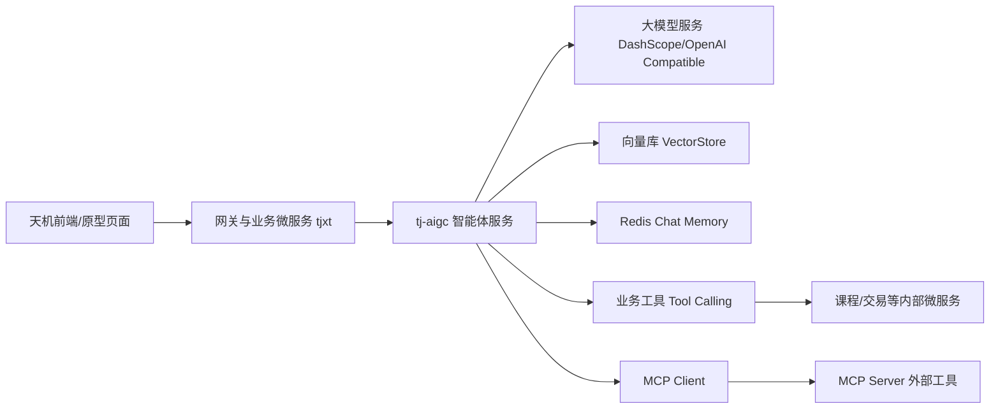
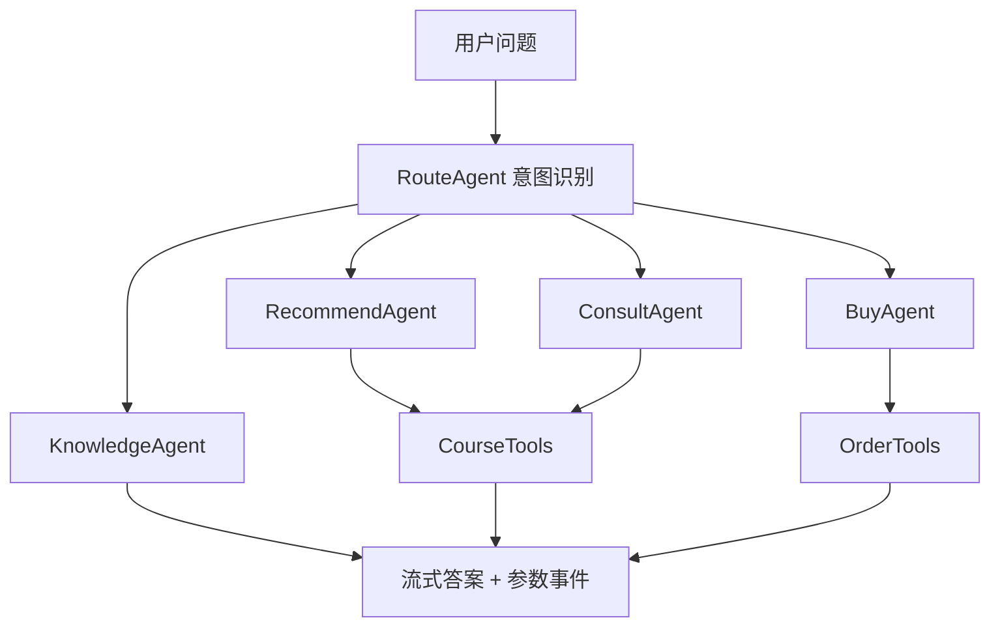

# tianji-ai-agent

🔥 A Spring AI agent engineering project based on Java, Spring Boot, MCP, and RAG workflows.  
🚀 Built for prompt engineering, tool calling, conversation memory, workflow routing, and multimodal AI assistants.  
⭐ Includes backend code, web prototypes, and UI assets for practical agent system development.

[](https://openjdk.org/)
[](https://spring.io/projects/spring-boot)
[](https://spring.io/projects/spring-ai)
[](https://maven.apache.org/)
[](#)

## 项目主周期（Main Timeline）

- `main 日期`：`2025.12 - 2026.01`
- `推进次数`：约 `14` 次（十几次迭代）

这是一个面向真实业务场景的 AI 智能体工程项目，目标不是“只会调用模型接口”，而是完整走通：
从大模型接入、Prompt 设计、Tool Calling、RAG 检索增强、会话记忆、路由工作流多智能体，到 MCP 与多模态语音能力，再到前端原型与 UI 交互设计落地。

仓库整合了三类核心资产：

- `代码/`：后端与智能体工程实现（Java + Spring AI + 微服务）
- 原型与 UI 大体积素材：已从主仓库拆分，按 `docs/resource-index.md` 获取资源包

如果你想搭建一个“能跑、能扩展、能解释其设计逻辑”的 AI 助手工程，这个仓库可以作为一套完整参考骨架。

## 目录

- [1. 项目定位](#1-项目定位)
- [2. 仓库结构](#2-仓库结构)
- [3. 课程文档与代码映射](#3-课程文档与代码映射)
- [4. 架构总览](#4-架构总览)
- [5. 核心模块拆解](#5-核心模块拆解)
- [6. 快速开始](#6-快速开始)
- [7. 原型与 UI 资产说明](#7-原型与-ui-资产说明)
- [8. 安全与密钥管理](#8-安全与密钥管理)
- [9. 常见问题](#9-常见问题)
- [10. 学习路径建议](#10-学习路径建议)
- [项目设计补充](#项目设计补充)
- [11. README 写作参考](#11-readme-写作参考)
- [12. 贡献与许可](#12-贡献与许可)

## 1. 项目定位

### 1.1 这不是单点 Demo，而是一条完整工程链路

很多 AI 项目只演示 `chat()` 调用成功，但一旦进入业务场景会立刻遇到问题：

- 如何让模型稳定遵循角色与流程？
- 如何安全地把“查课程、预下单”之类业务动作交给 Tool？
- 如何解决历史会话、停止生成、流式交互体验？
- 如何从“单智能体”过渡到“路由 + 专业子智能体”？
- 如何把能力扩展到语音、多模态、MCP 外部工具生态？

本项目正是围绕这些问题展开，覆盖了“能上线”的关键技术环节。

### 1.2 适合谁

- 想从 0 到 1 实战 Spring AI 的后端开发者
- 想把 AI 功能嵌入既有微服务业务系统的工程团队
- 想把课程学习内容转成可维护代码资产的学习者
- 想要“代码 + 原型 + UI”闭环样例的产品/技术协同团队

## 2. 仓库结构

```text
.
├── README.md
├── docs
│   └── resource-index.md
├── 代码
│   ├── openai-java-demo
│   ├── my-spring-ai
│   ├── my-spring-ai-mcp
│   └── tjxt
└── (external assets) prototype/ui packages
```

### 2.1 三大目录职责

| 目录 | 内容类型 | 作用 |
|---|---|---|
| `代码/` | Java 工程源码 | 智能体、微服务、MCP、多模态与业务集成主战场 |
| `天机agent V0.3/` | Web 原型页面 | 聊天窗口、历史对话、联想输入、语音交互等前端流程演示 |
| `天机AI助手/` | UI 视觉稿 | 组件规范、页面状态、问答社区与助手悬浮窗设计素材 |

### 2.2 项目规模速览

基于当前仓库统计：

- Java 源文件：约 `899` 个
- 原型 HTML 页面：约 `21` 个
- UI 图片资产：约 `24` 张
- 微服务模块（`tjxt`）：`17` 个子模块

## 3. 课程文档与代码映射

本 README 结合了课程的 7 份文档主线，并映射到仓库中的实际代码实现。

| 课程文档 | 核心主题 | 对应代码落点 | 你能直接验证什么 |
|---|---|---|---|
| `1.玩转AI大模型.md` | 大模型原理、Prompt 工程、OpenAI/百炼接入 | `代码/openai-java-demo` | 单轮/多轮/流式调用，课程推荐助手雏形 |
| `2.SpringAI入门.md` | ChatClient、Advisors、Tool、RAG | `代码/my-spring-ai` | SSE 流式聊天、天气 Tool、向量检索与多模态 |
| `3.基本功能.md` | 在天机项目中集成 AI、会话基础能力 | `代码/tjxt/tj-aigc` | 新建会话、历史会话、停止生成、聊天入口 |
| `4.课程咨询与购买.md` | Tool Calling 业务化（课程查询/购买） | `代码/tjxt/tj-aigc/tools` | `queryCourseById`、`prePlaceOrder` 链路 |
| `5.路由工作流.md` | 多智能体路由与协同 | `代码/tjxt/tj-aigc/agent` | Route/Recommend/Buy/Consult/Knowledge 多 Agent 协作 |
| `6.平台智能体、通用文本模型、语音.md` | 平台智能体接入、文本与语音能力 | `代码/tjxt/tj-aigc/controller/AudioController.java` | TTS 流式输出、STT 语音转文本 |
| `7.SpringAI高级与私有大模型.md` | MCP、多模态、结构化输出、私有模型 | `代码/my-spring-ai-mcp`、`代码/my-spring-ai` | MCP Client/Server、多模态输入输出 |

## 4. 架构总览

### 4.1 业务架构（代码 + 原型 + UI）



### 4.2 多智能体路由工作流



## 5. 核心模块拆解

### 5.1 `代码/openai-java-demo`：大模型调用基础与 Prompt 入门

关键类：

- `CompletionsDemo`：标准请求示例
- `CompletionsStreamingDemo`：流式输出
- `CompletionsMultipleRoundsDemo`：多轮对话状态维护
- `AICourseAssistant`：课程推荐助手原型

作用：

- 帮你理解“从原生 SDK 调用到业务对话结构化”的过渡
- 适合先把模型接口打通，再进入 Spring AI 封装层

### 5.2 `代码/my-spring-ai`：Spring AI 实战主干

关键能力：

- `ChatController`：普通对话、SSE 流式对话、向量检索、多模态聊天接口
- `ChatServiceImpl`：
  - `ChatClient` 调用链
  - `QuestionAnswerAdvisor` 接入 RAG
  - 会话记忆参数注入
  - 多模态 `qwen-omni-turbo` 示例
- `WeatherTools`：`@Tool` 注解工具调用样例
- `CityEmbedding`：向量化数据写入与检索配套

这个模块的价值在于：
把“框架能力点”都落在了可运行接口上，便于你逐段替换成自己的业务。

### 5.3 `代码/my-spring-ai-mcp`：MCP 客户端/服务端双向示例

子模块：

- `my-spring-ai-mcp-server`
  - `McpConfig` 对外暴露 Tool Callback
  - `WeatherService` 作为可被 MCP 调用的工具服务
- `my-spring-ai-mcp-client`
  - `ChatServiceImpl` 演示模型通过 MCP 扩展能力
  - `mcp-servers.json` 管理 MCP Server 列表

价值：

- 展示“把工具标准化为 MCP 服务”后的复用能力
- 便于后续接入浏览器自动化、地图、搜索、企业内系统能力

### 5.4 `代码/tjxt`：微服务业务底座 + `tj-aigc` 智能体核心

`tjxt` 聚合了 `17` 个模块（用户、课程、交易、支付、消息、网关等），其中 `tj-aigc` 是本项目 AI 核心。

### 5.4.1 `tj-aigc` 的核心接口

- `POST /chat`：SSE 流式多智能体聊天
- `POST /chat/stop`：停止生成
- `POST /chat/text`：通用文本聊天
- `GET /chat/templates`：模板推荐
- `POST /session`：新建会话
- `GET /session/history`：历史会话分组（当天/30天/1年/更早）
- `GET /session/{sessionId}`：单会话历史明细
- `POST /embedding`：向量写入
- `POST /audio/tts-stream`：文本转语音（流式）
- `POST /audio/stt`：语音转文本

### 5.4.2 `tj-aigc` 的关键设计

1. 路由工作流多智能体

- `RouteAgent` 做意图判断
- 将请求分发到 `RecommendAgent / BuyAgent / ConsultAgent / KnowledgeAgent`
- 各 Agent 可独立定义 `systemMessage`、`tools`、`advisors`

2. 业务工具结果回传

- `CourseTools` 与 `OrderTools` 调用内部微服务
- 通过 `ToolResultHolder` 把参数化结果回写到事件流
- `ToolResultHolder` 已补并发安全和过期清理，降低多工具并发写入与临时数据堆积风险
- 前端可据此渲染课程卡片、下单信息等结构化内容

3. 可中断的流式输出

- `GENERATE_STATUS` 跟踪会话生成状态
- 支持中途停止并保存已生成内容到历史记忆

4. 收敛式 RAG 检索

- `ConsultAgent`、`RecommendAgent` 与增强型 `ChatServiceImpl` 已改为使用当前问题作为检索 query
- 默认将召回数量收敛到 `topK=5`，并加入相似度阈值，减少“把整库塞进上下文”带来的噪声和成本

5. Redis 会话记忆

- `RedisChatMemory` 统一消息序列化存储
- 支持会话读取、清理、以及路由中间消息优化

## 6. 快速开始

> 建议先跑 `openai-java-demo` -> 再跑 `my-spring-ai` -> 再看 `tjxt/tj-aigc`，能明显降低学习成本。

### 6.1 一键启动（`dev-demo`，推荐）

这套仓库现在支持一个默认可演示的本地模式：

- 前端：`web/chat-ui`，默认保留 `demo` 优先体验
- 后端：`代码/tjxt/tj-aigc`，通过 `dev-demo` profile 提供 mock 会话、历史记录与 SSE 输出
- 中间件：MySQL / Redis 由 `docker-compose.dev.yml` 一次性拉起
- 不需要真实模型 API Key，也不需要额外登录 Token

第一次启动推荐直接用脚本：

```bash
# macOS
bash scripts/quick-start-mac.sh
```

```powershell
# Windows PowerShell
powershell -ExecutionPolicy Bypass -File .\scripts\quick-start-win.ps1
```

```bat
:: Windows CMD
scripts\quick-start-win.bat
```

可选参数（按需）：

- `--with-nacos` / `-WithNacos`：启用 Nacos profile
- `--with-search` / `-WithSearch`：启用 Elasticsearch profile
- `--detach` / `-Detach`：后台运行
- `--reset-env` / `-ResetEnv`：用 `.env.example` 覆盖现有 `.env`

手动方式（等价）也可用，两步即可：

```bash
cp .env.example .env
docker compose -f docker-compose.dev.yml up --build
```

启动完成后可以直接访问：

- 前端工作台：`http://127.0.0.1:5173`
- AIGC 后端：`http://127.0.0.1:8094`
- 热门会话接口：`http://127.0.0.1:8094/session/hot`

默认演示信息：

- Profile：`dev-demo`
- 演示用户 ID：`10001`
- 演示 Token：`dev-demo-token`
- 后端鉴权：已关闭，本地演示无需登录

如果你只想先看前端界面，即使后端尚未完全就绪，前端也会优先展示 `demo` 模式，不会一上来就因为 `401` 卡住。

按需启用 Nacos 与 Elasticsearch：

```bash
docker compose -f docker-compose.dev.yml --profile nacos --profile search up --build
```

### 6.2 环境要求

- JDK `17+`
- Maven `3.9+`
- Docker / Docker Compose（推荐，用于一键启动）
- Redis / MySQL / Elasticsearch（按模块启用，可由 `docker-compose.dev.yml` 拉起）
- 可用的大模型 API Key（仅在切换回真实模型时需要）

### 6.3 本地中间件启动（进阶）

如果你不想直接使用一键启动，也可以只拉中间件，然后手动运行后端：

```bash
docker compose -f docker-compose.dev.yml up -d mysql redis
```

按需加上 Nacos 与 Elasticsearch：

```bash
docker compose -f docker-compose.dev.yml up -d mysql redis nacos elasticsearch
```

### 6.4 环境变量

先复制模板：

```bash
cp .env.example .env
```

然后按需导出/覆盖（示例）：

```bash
# 一键启动默认读取这些本地开发值
export AIGC_BACKEND_PROFILE="dev-demo"
export AIGC_MYSQL_DATABASE="tj_aigc"
export AIGC_MYSQL_USERNAME="tianji"
export AIGC_MYSQL_PASSWORD="tianji123"
export AIGC_REDIS_HOST="127.0.0.1"
export AIGC_REDIS_PORT="6379"

# 大模型（阿里百炼 / OpenAI 兼容）
export ALIYUN_API_KEY="your_key"

# 可选：部分代码优先读取 AI_API_KEY
export AI_API_KEY="your_key"

# 百炼应用调用测试（tj-aigc 测试）
export BAILIAN_USER_TOKEN="your_token"

# MCP 地图服务（按需）
export AMAP_MAPS_API_KEY="your_amap_key"

# 短信模块（已改为环境变量占位）
export ALI_SMS_ACCESS_ID="your_access_id"
export ALI_SMS_ACCESS_SECRET="your_access_secret"

# tj-aigc 本地运行（不依赖 Nacos 时可直接使用本地默认值）
export AIGC_DATASOURCE_URL="jdbc:mysql://127.0.0.1:3306/tj_aigc?useUnicode=true&characterEncoding=UTF-8&serverTimezone=Asia/Shanghai&useSSL=false"
export AIGC_DATASOURCE_USERNAME="root"
export AIGC_DATASOURCE_PASSWORD="123456"
export AIGC_REDIS_HOST="127.0.0.1"
export AIGC_REDIS_PORT="6379"
```

### 6.5 模块级启动示例

1) OpenAI Java 示例

```bash
cd 代码/openai-java-demo
mvn -DskipTests compile
```

2) Spring AI 示例

```bash
cd 代码/my-spring-ai
mvn -DskipTests spring-boot:run
```

3) MCP Server + MCP Client

```bash
cd 代码/my-spring-ai-mcp/my-spring-ai-mcp-server
mvn -DskipTests spring-boot:run

cd ../my-spring-ai-mcp-client
mvn -DskipTests spring-boot:run
```

4) 天机 AI 微服务（按需）

```bash
cd 代码/tjxt
mvn -pl tj-aigc -am -DskipTests spring-boot:run -Dspring-boot.run.profiles=dev-demo
```

说明：

- `dev-demo` profile 已关闭真实模型依赖与登录拦截，适合演示、联调和面试讲解
- 如果你要切回真实模型，再把 `AIGC_BACKEND_PROFILE` 改为 `local`，并补充对应模型 Key 与业务环境
- `tjxt` 仍然是完整微服务体系，后续接入真实课程、交易、搜索能力时，建议结合课程环境逐步补齐

构建补充：

- 若使用 JDK 23+，仓库已在 `代码/tjxt/pom.xml` 的 `maven-compiler-plugin` 中显式配置 `<proc>full</proc>`，用于确保 Lombok 注解处理正常。
- 若需要在 `代码/tjxt/tj-aigc` 目录单独执行 `mvn -DskipTests compile`，请先在 `代码/tjxt` 根目录执行 `mvn -pl tj-aigc -am -DskipTests install`，预装兄弟模块产物（如 `tj-api`、`tj-auth-resource-sdk`）。

### 6.6 接口验证示例

以 `my-spring-ai` 为例：

```bash
curl -X POST http://localhost:8099/chat \
  -H 'Content-Type: application/json' \
  -d '{"question":"帮我推荐一个Java学习路径","sessionId":"s1"}'
```

流式接口示例：

```bash
curl -N -X POST http://localhost:8099/chat/stream \
  -H 'Content-Type: application/json' \
  -d '{"question":"解释一下RAG","sessionId":"s1"}'
```

### 6.6 测试与 CI 对齐

`tj-aigc` 的测试分为两类：

- 默认单元测试：可在本地和 CI 稳定运行
- 手工集成测试：依赖模型、Nacos、业务中间件，默认不在 CI 中执行

1) 运行默认单元测试（推荐日常开发使用）

```bash
mvn -B -ntp -f 代码/tjxt/tj-aigc/pom.xml test
```

2) 运行手工集成测试（需要完整环境与密钥）

```bash
mvn -B -ntp -f 代码/tjxt/tj-aigc/pom.xml -Pmanual-integration-tests test
```

3) 本地模拟 CI 关键链路（与仓库工作流一致）

```bash
mvn -B -ntp -f 代码/tjxt/pom.xml -pl tj-aigc -am -DskipTests package
mvn -B -ntp -f 代码/tjxt/tj-aigc/pom.xml test
```

## 7. 原型与 UI 资产说明

### 7.1 原型与 UI 资源获取

为降低主仓库体积，`天机agent V0.3/` 与 `天机AI助手/` 已改为外部资源包管理。

- 资源索引：`docs/resource-index.md`
- 建议分发方式：GitHub Releases / 独立 assets 仓库 / Git LFS

### 7.2 资源使用说明

- 原型资源包：用于交互流程演示（默认态、输入态、语音态、历史会话态等）
- UI 资源包：用于视觉稿与状态稿展示（聊天、问答、语音、规范页等）

说明：图稿中可能出现课程演示品牌/讲师文案（例如“天机学堂”“黑马小可爱”等），用于教学演示语境；若用于正式商用，请先统一替换品牌与人物文案。

## 8. 安全与密钥管理

为了能安全公开仓库，项目已进行一次密钥治理：

- 已移除/替换明显硬编码 Token 与 API Key
- 改为环境变量读取（示例见上方 `6.2`）
- 清理了历史日志与构建产物目录，避免意外泄漏

建议在你每次发布前执行：

```bash
# 检查常见明文 key
rg -n --pcre2 'sk-[A-Za-z0-9]{20,}|LTAI[0-9A-Za-z]{12,}|AKIA[0-9A-Z]{16}' .

# 检查 JWT
rg -n --pcre2 'eyJ[A-Za-z0-9_-]{20,}\.[A-Za-z0-9_-]{10,}\.[A-Za-z0-9_-]{10,}' .
```

## 9. 常见问题

### Q1：为什么我能编译 demo，但 `tjxt` 跑不起来？

`tjxt` 是完整微服务体系，不仅依赖 JDK/Maven，还依赖配置中心、数据库、Redis、ES、网关、鉴权链路等。建议按课程环境逐项补齐，再启动 `tj-aigc`。

### Q2：为什么流式输出会突然结束？

可能触发了主动停止逻辑（`/chat/stop`）或会话状态从 `GENERATE_STATUS` 中被移除。请先检查会话 ID 是否一致。

### Q3：工具调用结果为什么没在前端展示成卡片？

请确认前端是否消费了 `PARAM` 类型事件，并按 `ToolResultHolder` 回传字段渲染结构化 UI。当前实现已经给工具结果缓存增加了并发安全与 TTL 清理，如果仍然丢卡片，优先检查前端事件消费顺序。

### Q4：MCP 部分怎么扩展到自定义工具？

在 `my-spring-ai-mcp-server` 新增 `@Tool` 方法并通过 `ToolCallbacks.from(...)` 暴露，再在 client 侧配置对应 server 即可。

## 10. 学习路径建议

如果你是第一次接触这套工程，建议按下面顺序学习：

1. 先跑通 `openai-java-demo`，理解单轮/多轮/流式
2. 进入 `my-spring-ai`，掌握 ChatClient + Advisor + Tool + RAG
3. 学习 `my-spring-ai-mcp`，理解 MCP 对“工具复用”的价值
4. 阅读 `tj-aigc` 的 `controller -> service -> agent -> tools -> memory` 链路
5. 最后结合 `天机agent V0.3` + `天机AI助手`，把交互与后端事件流对应起来

这条路线和课程 7 份文档的演进顺序一致，学习成本最低。

## 项目设计补充

### 实现路径

项目按能力成熟度分阶段推进：

1. 先用 `openai-java-demo` 跑通单轮、多轮和流式调用，验证模型接入；
2. 再用 `my-spring-ai` 验证 ChatClient、Tool、RAG、多模态等通用能力；
3. 然后把这些能力接入 `tjxt/tj-aigc`，与真实业务微服务结合，补会话、历史记录、停止生成、课程工具调用等功能；
4. 最后再补前端原型和 UI 设计稿，让整套工程不仅“能跑”，也能展示完整的交互和系统结构。

### 关键难点

项目的主要难点在于将多个 AI 能力组合成稳定的业务链路：

- 多智能体不是简单拆分几个类，而是要解决路由、工具调用和结果输出之间的协同问题；
- RAG 需要在召回效果、上下文长度和回答稳定性之间取得平衡；
- Tool Calling 不只是演示调用成功，还要约束业务边界，避免模型越权操作；
- 流式输出、停止生成、历史会话、结构化事件返回叠加后，整体复杂度会明显提升。

### 当前处理方式

当前实现采用了多层拆分：

- 用 `RouteAgent` 做意图识别，再把请求分发给 `RecommendAgent / BuyAgent / ConsultAgent / KnowledgeAgent`，让多智能体职责清晰；
- 用 `CourseTools`、`OrderTools` 承接真实业务动作，并通过线程安全、带过期清理的 `ToolResultHolder` 把工具结果回写给前端，支持卡片化展示；
- 用 `RedisChatMemory` 维护会话消息，支持历史读取、上下文延续和中途停止生成后的保存；
- 通过流式接口返回模型输出，同时跟踪生成状态，保证前端可以做实时渲染和中断控制；
- 在咨询与推荐场景中使用“问题驱动 + 阈值约束”的 RAG 检索，避免召回噪声过大；
- 将 RAG、Tool、会话、语音、多模态等能力拆到不同模块，降低耦合，便于逐步演进。

### 后续优化方向

如果继续往生产化方向推进，优先级较高的方向包括：

- 增加提示词版本管理、效果评测和回放机制；
- 为多智能体路由增加更明确的策略评估与回退逻辑；
- 优化 RAG 的切片、召回、重排和来源展示，提升可解释性；
- 增加链路追踪、成本监控、模型切换和失败降级；
- 统一前后端事件协议，让卡片、工具结果和流式内容更稳定地对齐。

## 11. README 写作参考

本 README 在结构上参考了 GitHub 高关注项目的常见写法，重点借鉴了“信息分层清晰、快速上手优先、工程事实可验证”的组织方式：

- React README（简洁价值主张 + 安装/文档/示例）
- FastAPI README（核心特性先行 + 快速开始 + 丰富资源导航）
- Spring AI README（能力矩阵 + 架构定位 + 构建说明）

参考链接：

- [React README](https://github.com/facebook/react/blob/main/README.md)
- [FastAPI README](https://github.com/fastapi/fastapi/blob/master/README.md)
- [Spring AI README](https://github.com/spring-projects/spring-ai/blob/main/README.md)

## 12. 贡献与许可

### 12.1 贡献建议

欢迎以 Issue/PR 的方式提交：

- 文档修订与勘误
- 运行脚本优化
- 新工具接入示例
- 多智能体策略优化
- 前端原型与后端事件协议对齐

### 12.2 许可说明

本项目采用 [MIT License](LICENSE) 开源发布。

## 简历改造清单

- 追踪文件：[docs/resume-upgrade-checklist.md](docs/resume-upgrade-checklist.md)
- 评测清单：[docs/evaluation/multi-agent-eval-checklist.md](docs/evaluation/multi-agent-eval-checklist.md)
- 评测模板脚本：[scripts/evaluation/generate_agent_eval_template.py](scripts/evaluation/generate_agent_eval_template.py)
- CI 配置：[.github/workflows/ci.yml](.github/workflows/ci.yml)

本轮已落地：多智能体评测与工程化基线文件，便于继续补路由测试和可观测性。
