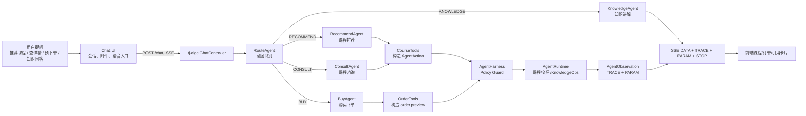
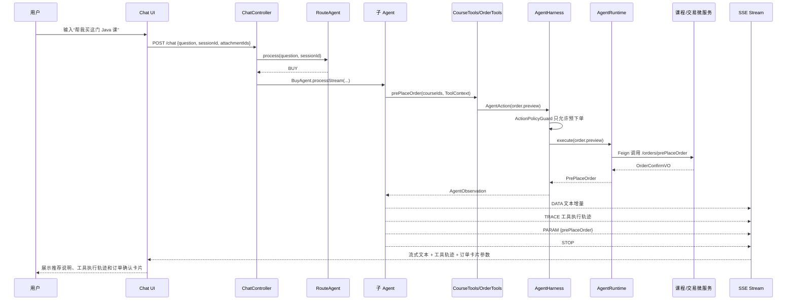
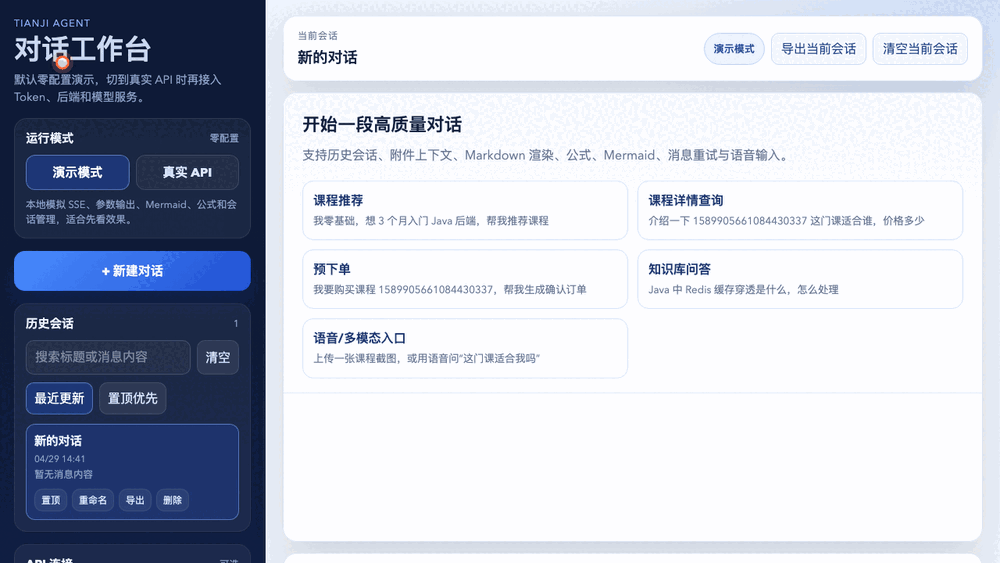
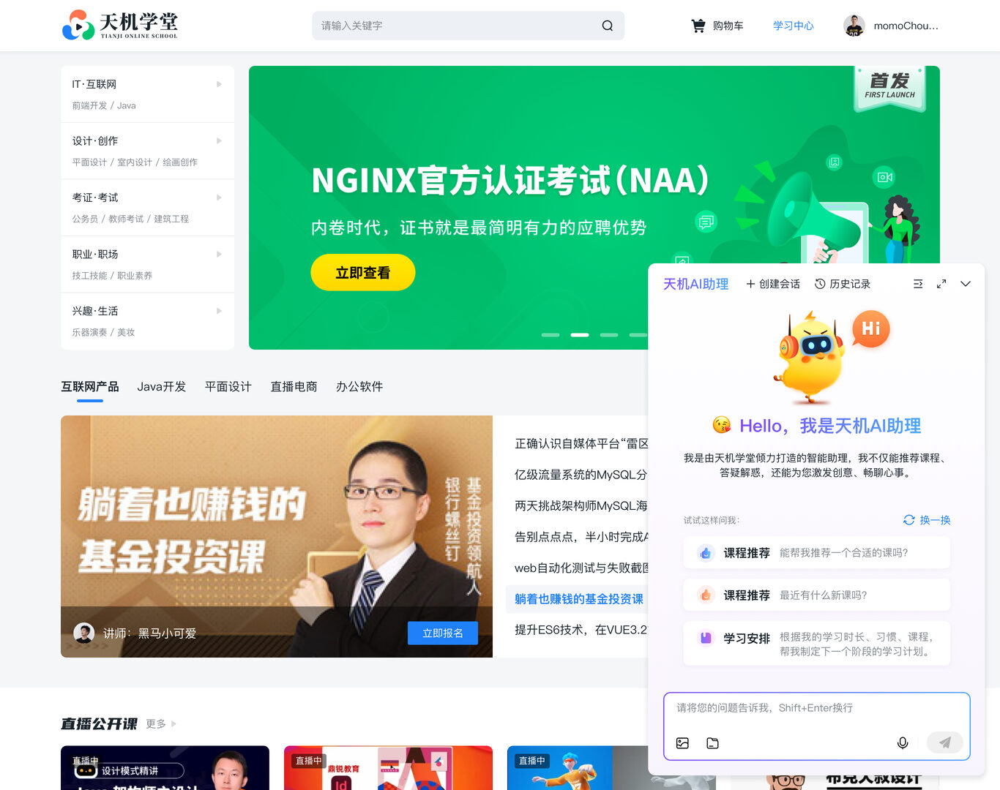
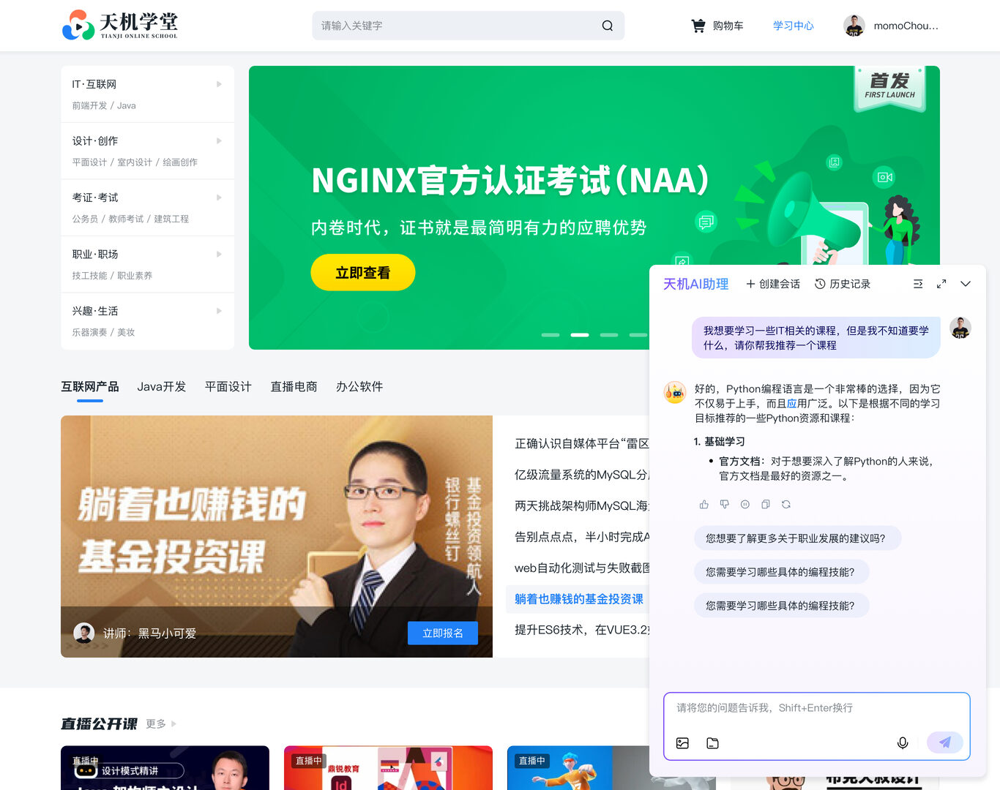
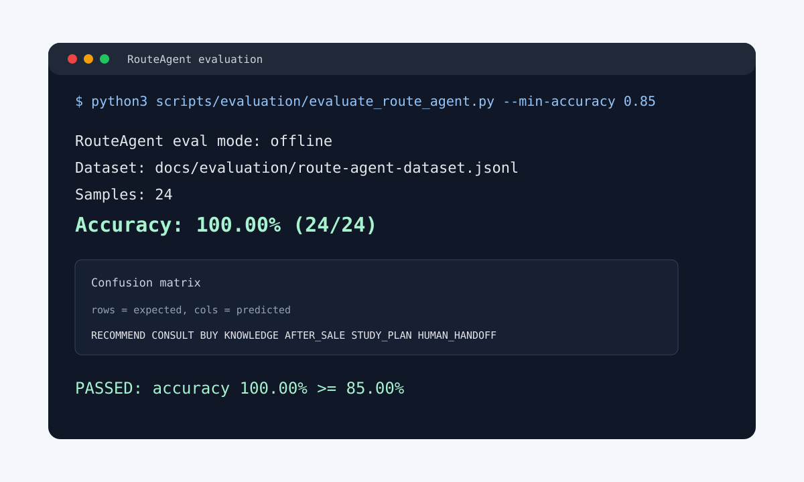
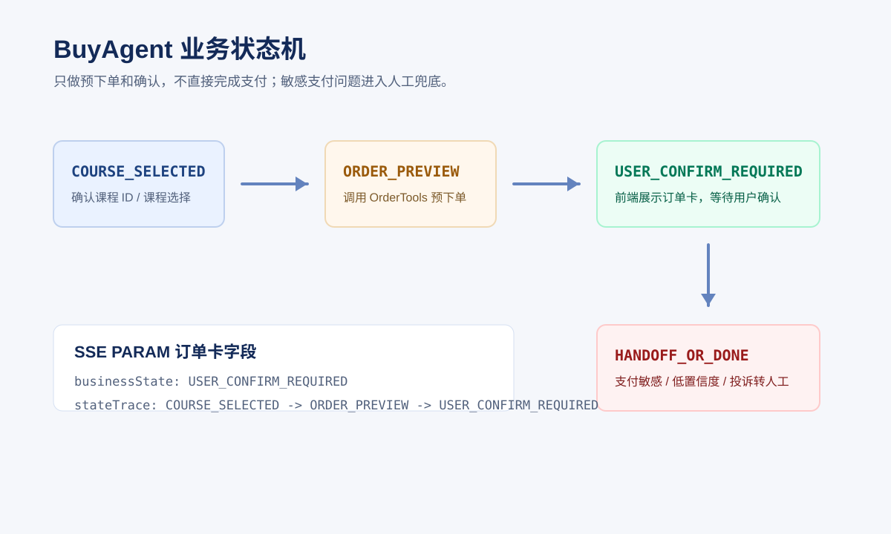

# tianji-ai-agent · 业务 Agent 案例：CloudAgent 智能客服

> **Matrix role:** `tianji-ai-agent` is the business Agent case study: intent routing, tool calling, SSE cards, MCP, and course-service workflows on top of the platform capabilities provided by [`knowledgeops-agent`](https://github.com/however-yir/knowledgeops-agent).
>
> **Business Agent Showcase** — 这不是一个框架 Demo，而是一个 **可运行的业务 Agent 工程案例**：围绕在线课程客服场景，展示如何用 Spring AI 多智能体架构完成从意图识别、课程推荐、预下单到售后转人工的完整业务闭环。

用户提问 -> RouteAgent 意图识别 -> 9 种子 Agent 分发 -> AgentHarness 治理业务动作 -> Runtime 调用课程/订单/KnowledgeOps -> Observation 写入 TRACE/PARAM -> SSE 流式返回 -> 前端课程/订单卡片与工具轨迹渲染。

[](https://github.com/however-yir/tianji-ai-agent/actions/workflows/ci.yml)
[](https://openjdk.org/)
[](https://spring.io/projects/spring-boot)
[](https://spring.io/projects/spring-ai)
[](https://maven.apache.org/)
[](.github/workflows/ci.yml)
[](#)

## 矩阵角色

`tianji-ai-agent` 是 however-yir AI 工程作品矩阵中的 **”CloudAgent 智能客服/课程顾问应用”**，作为 **KnowledgeOps Agent（多Agent企业AI平台）** 的业务落地案例。通过 `KnowledgeOpsClient` 调用平台 RAG/记忆/图谱能力，展示课程推荐、售前咨询、预下单、售后客服、投诉处理、转人工和 SSE 全链路事件回放。完整项目矩阵见 [docs/project-matrix.md](docs/project-matrix.md)。

## 业务闭环

`tianji-ai-agent` 不再定位为“学习型 AI 工程合集”，而是一个围绕在线课程业务搭建的智能体样板项目。它要讲清楚一件事：当用户说“我想学 Java，帮我推荐并下单”时，系统如何完成意图识别、课程查询、订单预确认、结构化卡片回传和流式交互。

核心链路：

1. 用户在聊天前端输入课程咨询、推荐或购买问题。
2. `tj-aigc` 接收 `/chat` 请求，建立会话上下文和附件上下文。
3. `RouteAgent` 判断意图（结构化 JSON：intent/confidence/routeReason/candidateAgents/nextAgent/needRag/needMemory/riskLevel），路由到 9 种子 Agent；投诉、低置信度和支付敏感问题统一兜底到 `HUMAN_HANDOFF`。
4. 子 Agent 通过 `CourseTools`、`OrderTools` 构造 `AgentAction`，交给 `AgentHarnessService` 执行 policy、runtime 和 observation。
5. `AgentRuntime` 调用课程、交易或 KnowledgeOps 能力；`HarnessEventRecorder` 把 `AgentObservation` 写入 `TRACE`，把课程/订单结果写入 `PARAM`。
6. 前端消费 `ROUTE / DATA / TRACE / EVIDENCE / MEMORY / PARAM / STOP` 事件，渲染路由链路、工具执行轨迹、课程卡片、订单卡片、route trace、引用来源、记忆命中和停止生成状态。

**可用 Agent 类型：** `ROUTE` | `RECOMMEND` | `CONSULT` | `BUY` | `KNOWLEDGE` | `AFTER_SALE` | `COMPLAINT` | `STUDY_PLAN` | `HUMAN_HANDOFF`

**SSE 事件类型：** `DATA(1001)` | `STOP(1002)` | `PARAM(1003)` | `ROUTE(1004)` | `TRACE(1005)` | `EVIDENCE(1006)` | `MEMORY(1007)`

## 一眼看懂


```mermaid
flowchart LR
    U["用户提问<br/>推荐课程 / 查详情 / 预下单 / 知识问答"] --> FE["Chat UI<br/>会话、附件、语音入口"]
    FE -->|POST /chat, SSE| API["tj-aigc ChatController"]
    API --> ROUTE["RouteAgent<br/>意图识别"]
    ROUTE -->|RECOMMEND| REC["RecommendAgent<br/>课程推荐"]
    ROUTE -->|BUY| BUY["BuyAgent<br/>购买下单"]
    ROUTE -->|CONSULT| CON["ConsultAgent<br/>课程咨询"]
    ROUTE -->|KNOWLEDGE| KNOW["KnowledgeAgent<br/>知识讲解"]
    REC --> COURSE["CourseTools<br/>构造 AgentAction"]
    CON --> COURSE
    BUY --> ORDER["OrderTools<br/>构造 order.preview"]
    COURSE --> HARNESS["AgentHarness<br/>Policy Guard"]
    ORDER --> HARNESS
    HARNESS --> RUNTIME["AgentRuntime<br/>课程/交易/KnowledgeOps"]
    RUNTIME --> OBS["AgentObservation<br/>TRACE + PARAM"]
    KNOW --> STREAM["SSE DATA"]
    OBS --> STREAM["SSE DATA + TRACE + PARAM + STOP"]
    STREAM --> CARD["前端课程/订单/引用卡片"]
```


```mermaid
sequenceDiagram
    participant User as 用户
    participant Web as Chat UI
    participant Chat as ChatController
    participant Route as RouteAgent
    participant Agent as 子 Agent
    participant Tool as CourseTools/OrderTools
    participant Harness as AgentHarness
    participant Runtime as AgentRuntime
    participant Biz as 课程/交易微服务
    participant SSE as SSE Stream

    User->>Web: 输入“帮我买这门 Java 课”
    Web->>Chat: POST /chat {question, sessionId, attachmentIds}
    Chat->>Route: process(question, sessionId)
    Route-->>Chat: BUY
    Chat->>Agent: BuyAgent.processStream(...)
    Agent->>Tool: prePlaceOrder(courseIds, ToolContext)
    Tool->>Harness: AgentAction(order.preview)
    Harness->>Harness: ActionPolicyGuard 只允许预下单
    Harness->>Runtime: execute(order.preview)
    Runtime->>Biz: Feign 调用 /orders/prePlaceOrder
    Biz-->>Runtime: OrderConfirmVO
    Runtime-->>Harness: PrePlaceOrder
    Harness-->>Agent: AgentObservation
    Agent-->>SSE: DATA 文本增量
    Agent-->>SSE: TRACE 工具执行轨迹
    Agent-->>SSE: PARAM {prePlaceOrder}
    Agent-->>SSE: STOP
    SSE-->>Web: 流式文本 + 工具轨迹 + 订单卡片参数
    Web-->>User: 展示推荐说明、工具执行轨迹和订单确认卡片
```

## 聊天界面截图



| 默认对话 | 课程卡片 |
|---|---|
|  |  |

| 购买课程 | 语音入口 |
|---|---|
|  |  |

| 路由准确率 | 业务状态机 |
|---|---|
|  |  |

## 项目结构

```text
.
├── README.md
├── docs
│   ├── agent-design.md
│   ├── agent-harness.md
│   ├── demo-script.md
│   ├── mcp-extension-guide.md
│   ├── multi-tenant-isolation.md
│   ├── observability/
│   │   └── slo-and-alerting.md
│   └── assets/screenshots
├── helm/tianji-ai-agent/         # Helm Chart
├── tests/e2e/                    # E2E 冒烟测试
├── web/chat-ui
│   └── 课程业务 Agent 前端原型
└── src
    ├── openai-java-demo
    ├── my-spring-ai
    ├── my-spring-ai-mcp
    └── tjxt
        ├── checkstyle.xml        # 代码规范配置
        └── tj-aigc
```

| 模块 | 角色 | 展示价值 |
|---|---|---|
| `web/chat-ui` | React 聊天前端 | 会话、SSE、停止生成、附件、语音入口、课程/订单卡片 |
| `src/tjxt/tj-aigc` | 业务 Agent 核心 | RouteAgent、子 Agent、Tool Calling、Redis 记忆、附件服务 |
| `src/tjxt/tj-api` | 业务微服务契约 | CourseClient、TradeClient 等 Feign 接口 |
| `src/openai-java-demo` | SDK 入门样例 | 保留教学路径，用课程推荐助手解释基础调用 |
| `src/my-spring-ai` | Spring AI 能力样例 | ChatClient、Advisor、Tool、RAG、多模态基础能力 |
| `src/my-spring-ai-mcp` | MCP 扩展示例 | 把工具封装为可复用 MCP Server/Client |

## Demo 闭环

演示脚本见 [docs/demo-script.md](docs/demo-script.md)。固定准备 5 个问题：

| 场景 | 演示问题 | 命中的后端链路 | 前端展示 |
|---|---|---|---|
| 课程推荐 | `我零基础，想 3 个月入门 Java 后端，帮我推荐课程` | `RouteAgent -> RecommendAgent -> AgentHarness -> course.query` | 推荐说明、课程卡片、工具轨迹 |
| 课程详情 | `介绍一下 1589905661084430337 这门课适合谁，价格多少` | `RouteAgent -> ConsultAgent -> AgentHarness -> course.query` | 课程详情卡片、工具轨迹 |
| 预下单 | `我要购买课程 1589905661084430337，帮我生成确认订单` | `RouteAgent -> BuyAgent -> AgentHarness -> order.preview` | 订单确认卡片、工具轨迹 |
| 知识问答 | `Java 中 Redis 缓存穿透是什么，怎么处理` | `RouteAgent -> KnowledgeAgent` | 流式知识回答 |
| 语音/多模态入口 | `上传一张课程截图，或用语音问“这门课适合我吗”` | `/attachment/upload`、`/audio/stt`、`/audio/tts-stream`、`/chat` | 附件引用、语音输入、流式回复 |

证据索引见 [docs/evidence/README.md](docs/evidence/README.md)，包含运行路径、截图、Agent 设计文档、CI 和发布信息。

## 后端核心

`tj-aigc` 的接口以业务闭环为中心，而不是为了罗列框架能力：

| 接口 | 作用 | 前端对应 |
|---|---|---|
| `POST /session?n=4` | 新建会话并返回推荐问题 | 新会话按钮、示例问题 |
| `GET /session/history` | 查询历史会话分组 | 左侧会话列表 |
| `GET /session/{sessionId}` | 查询单会话消息 | 切换历史会话 |
| `POST /chat` | SSE 流式 Agent 对话 | 主输入框发送 |
| `POST /chat/stop` | 停止当前生成 | 停止按钮 |
| `POST /attachment/upload` | 上传文档/图片并返回附件 ID | 附件按钮 |
| `POST /audio/stt` | 语音转文本 | 语音输入入口 |
| `POST /audio/tts-stream` | 文本转语音 | 语音播放入口 |

关键类：

| 类 | 说明 |
|---|---|
| `ChatController` | 统一接入聊天、停止生成和模板接口 |
| `AgentServiceImpl` | 调用 `RouteAgent` 并分发到子 Agent |
| `RouteAgent` | 意图识别，只做路由，不使用附件上下文 |
| `RecommendAgent` | 课程推荐，绑定 `CourseTools` 与 RAG Advisor |
| `ConsultAgent` | 课程咨询，查询课程详情和补充解释 |
| `BuyAgent` | 购买链路，绑定 `OrderTools` 做预下单，状态机为 `COURSE_SELECTED -> ORDER_PREVIEW -> USER_CONFIRM_REQUIRED -> HANDOFF_OR_DONE` |
| `KnowledgeAgent` | 通用知识讲解，不强依赖业务工具 |
| `AgentHarnessService` | 治理 `AgentAction`，串联 policy、runtime、observation |
| `CourseTools` | 保持 Spring AI Tool 入口，内部提交 `course.query` 动作 |
| `OrderTools` | 保持 Spring AI Tool 入口，内部提交 `order.preview` 动作 |
| `RedisChatMemory` | 会话记忆读写，支撑历史上下文 |
| `InMemoryAttachmentService` | dev/demo 可用的附件解析、切片、引用来源服务 |

更多设计说明见 [docs/agent-design.md](docs/agent-design.md) 和 [docs/agent-harness.md](docs/agent-harness.md)。

## 快速开始

推荐先跑 `dev-demo`，不用真实模型 Key，也不用登录。

```bash
bash scripts/quick-start-mac.sh
```

Windows:

```powershell
powershell -ExecutionPolicy Bypass -File .\scripts\quick-start-win.ps1
```

手动启动：

```bash
cp .env.example .env
docker compose -f docker-compose.dev.yml up --build
```

默认访问：

| 服务 | 地址 |
|---|---|
| Chat UI | `http://127.0.0.1:5173` |
| AIGC 后端 | `http://127.0.0.1:8094` |
| 热门问题接口 | `http://127.0.0.1:8094/session/hot` |

`dev-demo` 说明：

- 后端 profile：`dev-demo`
- 演示用户 ID：`10001`
- 演示 Token：`dev-demo-token`
- 本地演示默认关闭登录拦截
- 前端默认进入 demo 模式，也可以切到真实 API 模式联调

## 本地验证

前端：

```bash
cd web/chat-ui
npm ci
npm run lint
npm run test:run
npm run build
```

后端核心链路：

```bash
mvn -B -ntp -f src/tjxt/pom.xml -pl tj-aigc -am -DskipTests package
mvn -B -ntp -f src/tjxt/tj-aigc/pom.xml test
```

RouteAgent 评测：

```bash
python3 scripts/evaluation/evaluate_route_agent.py --min-accuracy 0.85
```

示例输出会包含 `Accuracy` 和混淆矩阵；默认离线模式用于本地快速回归，也可以传 `--api-url http://127.0.0.1:8094` 读取真实 `/chat` SSE 的 `ROUTE(1004)` 事件。

手工集成测试依赖真实模型、Nacos、业务中间件和密钥，默认通过 JUnit Tag 排除：

```bash
mvn -B -ntp -f src/tjxt/tj-aigc/pom.xml -Pmanual-integration-tests test
```

## CI 与质量门槛

仓库把”展示项目必须稳定”的链路设为阻断：

- `web/chat-ui`：lint、unit test、build
- `tj-aigc`：依赖链安装、单元测试、JaCoCo 覆盖率报告上传
- `my-spring-ai`：编译打包
- Python smoke tests：仓库文档和脚本基础检查

非关键扫描保留为 advisory job（`continue-on-error: true`），避免噪声挡住核心链路：

| Advisory Job | 工具 | 用途 |
|---|---|---|
| Python Quality | Ruff + compileall | Python 代码规范 |
| Secret Scan | Gitleaks | 硬编码密钥检测 |
| Java Quality | Checkstyle + SpotBugs | Java 代码规范 + 静态分析 |
| OWASP Dependency Check | dependency-check-maven | 已知漏洞依赖扫描（CVSS >= 7） |
| Container Image Scan | Trivy | Dockerfile 文件系统扫描（HIGH/CRITICAL） |

Spring AI 版本兼容说明见 [docs/spring-ai-version-note.md](docs/spring-ai-version-note.md)。

## 安全加固

- **密钥外部化**：所有敏感配置（Keystore、Nacos、数据源）改为环境变量引用，禁止提交明文
- **限流**：基于 IP 的令牌桶限流（60 req/min），超限返回 HTTP 429
- **安全响应头**：X-Content-Type-Options、X-Frame-Options、Referrer-Policy、Permissions-Policy
- **文件上传**：PDF/PNG/JPEG/DOCX 魔数校验，防止扩展名伪造

## 可观测性

- **Spring Boot Actuator**：`/actuator/health`（含 liveness/readiness）、`/actuator/info`
- **Prometheus 指标**：`/actuator/prometheus`，HTTP 请求延迟百分位直方图
- **结构化日志**：logstash-logback-encoder，生产环境输出 JSON 格式
- **SLO 定义与告警规则**：见 [docs/observability/slo-and-alerting.md](docs/observability/slo-and-alerting.md)

## 部署

### Helm Chart

```bash
helm install tianji-ai-agent helm/tianji-ai-agent/ \
  --set image.repository=tianji/tj-aigc \
  --set image.tag=latest \
  --set env.SPRING_PROFILES_ACTIVE=local
```

Chart 包含 Deployment、Service 和 liveness/readiness 探针配置。

### Docker Compose

```bash
docker compose -f docker-compose.dev.yml up --build
```

## MCP 扩展

MCP 不是本项目的主叙事，但保留为“后续把课程、交易、搜索、浏览器自动化等工具标准化”的扩展位。

扩展指南见 [docs/mcp-extension-guide.md](docs/mcp-extension-guide.md)。

## 演示路径

1. 打开 Chat UI，输入"我零基础，想 3 个月入门 Java 后端，帮我推荐课程"
2. 观察 RouteAgent 意图识别 → RecommendAgent → CourseTools 查询 → SSE 课程卡片返回
3. 输入"我要购买课程 1589905661084430337，帮我生成确认订单"
4. 观察 RouteAgent → BuyAgent → OrderTools 预下单 → SSE 订单确认卡片
5. 输入"Java 中 Redis 缓存穿透是什么"
6. 观察 RouteAgent → KnowledgeAgent → SSE 流式知识回答

录屏建议：

```text
用户输入购课问题 -> 后端 RouteAgent 命中 BuyAgent -> OrderTools 预下单 -> SSE 返回 DATA/PARAM/STOP -> 前端渲染订单卡片
```

## 资源说明

原始大体积设计稿和原型包默认不纳入主仓库，见 [docs/resource-index.md](docs/resource-index.md)。README 中使用的是压缩后的展示截图，位于 `docs/assets/screenshots`。

## Release

当前展示版发布说明见 [CHANGELOG.md](CHANGELOG.md)。

## 许可

本项目采用 [MIT License](LICENSE)。
