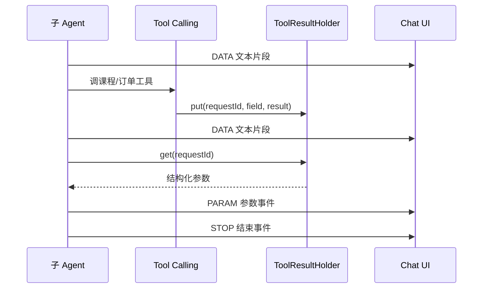

# Agent Design

本文解释 `tianji-ai-agent` 的业务智能体设计。主线是课程咨询、推荐和购买，不把技术名词堆成清单。

## 设计原则

1. `RouteAgent` 只做意图识别，避免把业务工具、附件上下文和长历史都塞进路由阶段。
2. 子 Agent 按业务动作拆分，而不是按技术能力拆分。
3. 涉及课程、订单等事实数据时，必须通过 Tool Calling 获取，不让模型凭空生成。
4. 前端协议稳定为 `DATA / PARAM / STOP`，让 UI 可以同时处理流式文本和结构化卡片。
5. `dev-demo` 保证零密钥可演示，真实 profile 保留完整模型和微服务集成路径。

## Agent 职责

| Agent | 输入 | 输出 | 工具 | 记忆 | 说明 |
|---|---|---|---|---|---|
| `RouteAgent` | 用户问题、sessionId | `RECOMMEND / BUY / CONSULT / KNOWLEDGE` | 无 | 关闭 | 轻量路由，减少上下文噪声 |
| `RecommendAgent` | 学习目标、基础、时间、预算 | 推荐说明、课程参数 | `CourseTools` | 开启 | 适合推荐课程和学习路径 |
| `ConsultAgent` | 课程 ID、课程问题、附件引用 | 课程详情解释 | `CourseTools` | 开启 | 适合价格、适用人群、课程介绍 |
| `BuyAgent` | 课程 ID 列表、用户身份 | 预下单说明、订单参数 | `OrderTools` | 开启 | 只做预下单，不直接支付 |
| `KnowledgeAgent` | 通用技术问题 | 知识回答 | 无或 RAG Advisor | 开启 | 适合 Java、Redis、学习方法等问答 |

## 路由策略

`AgentServiceImpl.chat()` 的执行顺序：

```text
chat(question, sessionId)
  -> find RouteAgent
  -> routeAgent.process(question, sessionId)
  -> AgentTypeEnum.agentNameOf(result)
  -> find target agent
  -> targetAgent.processStream(question, sessionId)
```

如果路由结果不是合法 Agent 名称，则把 `RouteAgent` 的文本当作普通回答返回，并附上附件引用参数。

## Tool Calling 边界

### CourseTools

`CourseTools.queryCourseById(courseId, toolContext)` 负责：

- 调用 `CourseClient.baseInfo(courseId, true)`。
- 将 `CourseBaseInfoDTO` 转成前端可展示的 `CourseInfo`。
- 把结果写入 `ToolResultHolder`，字段形如 `courseInfo_{courseId}`。

### OrderTools

`OrderTools.prePlaceOrder(ids, toolContext)` 负责：

- 从 `ToolContext` 读取用户 ID，写入 `UserContext`。
- 调用 `TradeClient.prePlaceOrder(courseIds)`。
- 将 `OrderConfirmVO` 转成 `PrePlaceOrder`。
- 把结果写入 `ToolResultHolder`，字段为 `prePlaceOrder`。

### 业务边界

`BuyAgent` 当前只做预下单确认，不直接支付。正式支付应继续走交易服务的鉴权、风控和支付确认链路，不能由模型直接完成。

## SSE 返回协议



前端不从模型文本里解析课程或订单信息，而是优先消费 `PARAM`。

## 会话记忆

`RedisChatMemory` 负责把用户消息、助手消息和可回放参数写入 Redis：

- 读取时按尾部窗口取最近消息，避免上下文无限增长。
- `MessageUtil` 会把工具结果参数内联到助手历史消息，历史会话也能恢复卡片。
- 停止生成时，`AbstractAgent.saveStopHistoryRecord()` 会保存已生成片段，避免用户中断后丢失上下文。

## 附件服务

`InMemoryAttachmentService` 面向本地 demo 和轻量展示：

- 支持 txt、PDF、DOCX 和图片 OCR 占位能力。
- 上传后返回 `attachmentId`、预览文本和切片数量。
- `/chat` 前根据 `attachmentIds` 构造 `AttachmentContext`。
- Agent 系统提示词中注入最相关片段，并通过 `PARAM.sources` 返回引用来源。

生产化时建议替换为对象存储、异步解析、向量索引和权限校验。

## 停止生成

前端点击停止：

```text
AbortController.abort()
POST /chat/stop?sessionId=...
```

后端：

- `ChatController.stop()` 清理附件上下文。
- `AgentServiceImpl.stop()` 委托给 `RouteAgent.stop()`。
- `AbstractAgent.stop()` 删除 `GENERATE_STATUS[sessionId]`。
- 流式链路通过 `takeWhile` 停止继续输出。

## 演进方向

| 方向 | 建议 |
|---|---|
| 路由准确率 | 增加固定评测集，统计路由混淆矩阵 |
| 工具安全 | 为课程 ID、用户 ID、订单状态增加显式校验 |
| RAG 可解释性 | 增加来源片段、重排分数和引用展示 |
| 分布式停止生成 | 将 `GENERATE_STATUS` 从内存迁移到 Redis |
| 观测性 | 记录 route、tool、latency、token、cost 等指标 |
